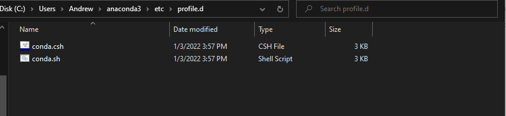

# On the Windows
1. Access to Anaconda/etc/profile.d/

2. Open gitbase from this folder. Now, so long as the path to your file has no spaces, you can add conda.sh to your .bashrc with this simple command:
```echo ". ${PWD}/conda.sh" >> ~/.bashrc```
3. Then, reopen Git bash and tap conda

4. Troubles with python
we need to add this line into the file .bashrc : 
```alias python='winpty /C/Users/Andrew/anaconda3/python.exe'```