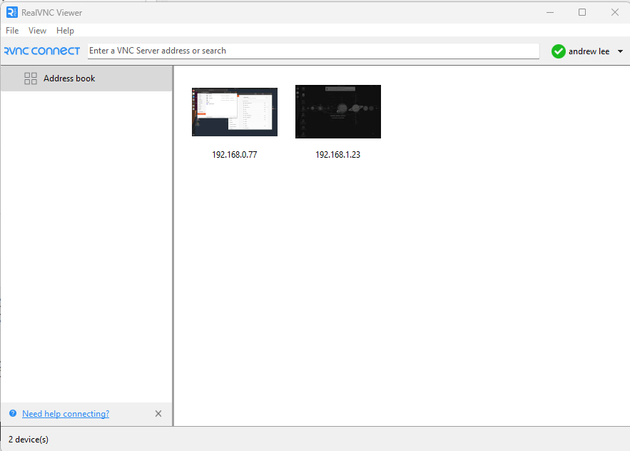
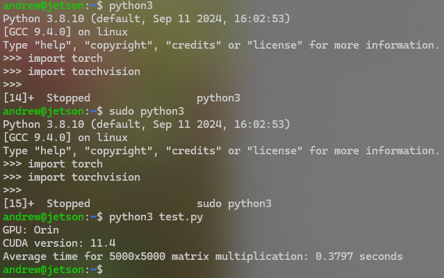
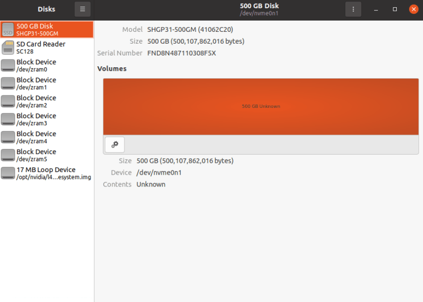

# Table of contents
**This repo is helpping to 🚅 Initial Setup Jetson Orin Nano**
- [JETSON ORIN NANO Specs](##jetson-orin-nano)
- [Jetson ORIN NANO OS installation](#write-image-to-the-microsd-card)
- [Fundamentals installation](##fundamentals-installation)
- [Control the jetson orin GUI remotely](##headless-servers)
    - [1. On Jetson Orin](###1.-on-jetson-orin)
        - [1.1. Setup VNC server on the Jetson developer kit](####1.1.-setup-vnc-server-on-the-jetson-developer-kit)
        - [1.2. Enable virtual display for VNC](####1.2.-enable-virtual-display-for-vnc)
    - [2. On Client to access Jetson remotely via VNC service](#2-on-client-to-access-jetson-remotely-via-vnc-service)
- [Setup AI environment for Jetson Orin Nano](#setup-ai-environment)
- [Activate the NVMe SSD Card](#activate-the-nvme-ssd-card)
---


## JETSON ORIN NANO
<table border="0">
 <tr>
    <td style="width: 50%; vertical-align: top">
         
    </td>
    <td>
        Jetson Orin Nano Developer Kit:
        <br>
        - Deliver up to <b>80x</b> the performance over the Jetson Nano
        <br>
        - Supports for external <b>NVMe</b>
        <br>
        - 802.11ac/abgn wireless network interface controller
        <br>
        - <b>DisplayPort</b>
        <br> 
        - <b>AI Performance:</b> 40 TOPS
        <br>
        - <b>CPU</b>: 6-core Arm® Cortex®-A78AE v8.2 64-bit CPU 1.5MB L2 + 4MB L3
        <br>
        - <b>GPU</b>: 1024-core NVIDIA Ampere architecture GPU with 32 Tensor Cores	
        <br>
        - <b>RAM </b>: 8GB 128-bit LPDDR5
        <br>
        <b>Details: <a href="https://www.nvidia.com/en-us/autonomous-machines/embedded-systems/jetson-orin/">developer.nvidia</a>
    </td>
 </tr>
</table>

## Write Image to the microSD Card
- **Step 1**: Download the [Jetson Nano Developer Kit SD Card Image](https://developer.nvidia.com/downloads/embedded/l4t/r35_release_v3.1/sd_card_b49/jp511-orin-nano-sd-card-image.zip/), and note where it was saved on the computer. **Note: unzip your download file to get `sd-blob.img`.** (I was using `jpxx-orin-nano-sd-card-image.zip` to flash and then I couldn't boot, but using `.zip` file to flask if you're using jetson nano (not orin) might work)
    - I'm using [JetPack SDK 5.1.1](https://developer.nvidia.com/downloads/embedded/l4t/r35_release_v3.1/sd_card_b49/jp511-orin-nano-sd-card-image.zip/) for this setup. I tried  Jetpacl 6.1 is not working for me.
- **Step 2**: Write the image to your microSD card by:
    + Download, install, and launch [Etcher](https://www.balena.io/etcher).
    + Click “Select drive” and choose the correct device. 
    
    
- Then start the Jetson Nano to First Boot
---
## Necessary installation
- Update and upgrade: `sudo apt-get update && sudo apt-get upgrade`
- Install **SSH-server**: `sudo apt-get install openssh-server`
- Install **nano**: `sudo apt-get install nano`
- Install **pip**: `sudo apt install python3-pip`
- Install **jtop**: `sudo pip3 install jetson-stats`
---

## Headless Servers
> Configure VNC to control the jetson orin GUI remotely (a.k.a Headless Servers)
### 1. On Jetson Orin:
#### 1.1. Setup VNC server on the Jetson developer kit
- Step 1: Enable the VNC server to start each time you log in
```shell
mkdir -p ~/.config/autostart
cp /usr/share/applications/vino-server.desktop ~/.config/autostart/.
```

- Step 2: Configure the VNC server
```shell
gsettings set org.gnome.Vino prompt-enabled false
gsettings set org.gnome.Vino require-encryption false
```
- Step 3: Set a password to access the VNC server
```shell
gsettings set org.gnome.Vino authentication-methods "['vnc']"
gsettings set org.gnome.Vino vnc-password $(echo -n 'thepassword' | base64) # Replace thepassword with your desired password
sudo reboot # Reboot the system so that the settings take effect
```


Check detail here: [developer.nvidia.com](https://developer.nvidia.com/embedded/learn/tutorials/vnc-setup)
#### 1.2. Enable virtual display for VNC (Optionally)
Note: 
- This setting helps you remote access Jetson without monitor but high resolution. Because, VNC requires Monitor to know the resolution to render the Jetson virtual resolution. Without using monitor when you boot your Jetson, you can see this tiny resolution :)) ( this one is true for NoNachine too)


- In my case, I usually need to plug in HDMI the monitor first to make Jetson recognize resolution feature, then plug out HDMI. Or another sulution is you always need to align this by using `xrandr --fb {custom_resolution}`

- **If you turn this function on, after rebooting, jetson cannot export signal to your physical monitor!**

**Step 1: Update and install xserver-xorg-video-dummy**

This driver is used to create a virtual display, which is useful when you need a graphical environment without a physical monitor attached.

```
$ sudo apt update
$ sudo apt install xserver-xorg-video-dummy
```

**Step 2: Create config for dummy virtual display**
```
$ cd /etc/X11
$ sudo nano xorg.conf.dummy
```

**Step 3: Add the following contents in xorg.conf.dummy (resolution 1920*1080 as example)**
- Check the suitable resolution: `xrandr --verbose`
```
Section "Device"
    Identifier "DummyDevice"
    Driver "dummy"
    VideoRam 256000
EndSection
 
Section "Screen"
    Identifier "DummyScreen"
    Device "DummyDevice"
    Monitor "DummyMonitor"
    DefaultDepth 24
    SubSection "Display"
        Depth 24
        # Modes "1920x1080_60.0"
        # Modes "1280x800"
        Modes "1440x900"
    EndSubSection
EndSection
 
Section "Monitor"
    Identifier "DummyMonitor"
    HorizSync 30-70
    VertRefresh 50-75
    # ModeLine "1920x1080" 148.50 1920 2448 2492 2640 1080 1084 1089 1125 +Hsync +Vsync
    # ModeLine "1280x800" 83.5 1280 1352 1480 1680 800 803 809 831 -HSync +Vsync
    ModeLine "1440x900" 106.5 1440 1520 1672 1904 900 903 909 934 -HSync +Vsync
EndSection
```

**Step 4: Update /etc/X11/xorg.conf**
```
$ cp xorg.conf xorg.conf.backup
$ cp xorg.conf.dummy xorg.conf
```

**Step 5: Reboot the board**
```
$ sudo reboot
```

##### Discussing here: 
- [What is the best way to control the jetson Orin GUI remotely?](https://forums.developer.nvidia.com/t/what-is-the-best-way-to-control-the-jetson-orin-gui-remotely/239615/5)
- [GUIDE: Headless Remote Access on Jeston Orin Nano (and other devices using linux nVidia drivers)](https://forums.developer.nvidia.com/t/guide-headless-remote-access-on-jeston-orin-nano-and-other-devices-using-linux-nvidia-drivers/267941)

#### 1.3. Disable virtual display to use with physical Monitor
-> Change content of file `xorg.conf`to be original: 
```yaml
# Copyright (c) 2011-2013 NVIDIA CORPORATION.  All Rights Reserved.

#
# This is the minimal configuration necessary to use the Tegra driver.
# Please refer to the xorg.conf man page for more configuration
# options provided by the X server, including display-related options
# provided by RandR 1.2 and higher.

# Disable extensions not useful on Tegra.
Section "Module"
    Disable     "dri"
    SubSection  "extmod"
        Option  "omit xfree86-dga"
    EndSubSection
EndSection

Section "Device"
    Identifier  "Tegra0"
    Driver      "nvidia"
# Allow X server to be started even if no display devices are connected.
    Option      "AllowEmptyInitialConfiguration" "true"
EndSection
```


### 2. On Client to access Jetson remotely via VNC service
***Note: You’ll need to know the IP address of your Jetson developer kit to connect from another computer***
#### 2.1. LINUX 
- Step 1: Install gvncviewer by executing following commands:
```shell
sudo apt update
sudo apt install gvncviewer
```
- Step 2: Launch gvncviewer
```shell
gvncviewer 192.168.1.23 # replace this IP to Jetson's IP
```
- Step 3: If you have configured the VNC server for authentication, provide the VNC password


Check detail here: [developer.nvidia.com](https://developer.nvidia.com/embedded/learn/tutorials/vnc-setup)

#### 2.2. WINDOWS
- Step 1: Download and Install VNC viewer from [here](https://www.realvnc.com/en/connect/download/viewer/)
- Step 2: Launch the VNC viewer and type in the IP address of your developer kit


---

## Setup AI environment 
### 1. Setup CUDA Environment
- Check CUDA version, "command not found" is shown, and you need to configure the following environment:  `nvcc -V`
 ```
 Note: the command "nvcc" we used here can not view the version. You can enter the /usr/local/ directory to see if there is a CUDA directory.
If not, refer to the SDK (including CUDA) installation, and then configure the environment after the installation is complete.
```
- Setup environment variables.
```shell
sudo vim .bashrc
Add the following at the end of the file:
export LD_LIBRARY_PATH=/usr/local/cuda/lib
export PATH=$PATH:/usr/local/cuda/bin
```

- Update the environment variables: `source .bashrc`
- View the CUDA version again: `nvcc -V`
```
Copyright (c) 2005-2022 NVIDIA Corporation
Built on Sun_Oct_23_22:16:07_PDT_2022
Cuda compilation tools, release 11.4, V11.4.315
Build cuda_11.4.r11.4/compiler.31964100_0
```
### 2. PyTorch on Jetson Platform
- Install system packages required by PyTorch:
```shell
sudo apt-get -y install autoconf bc build-essential g++-8 gcc-8 clang-8 lld-8 gettext-base gfortran-8 iputils-ping libbz2-dev libc++-dev libcgal-dev libffi-dev libfreetype6-dev libhdf5-dev libjpeg-dev liblzma-dev libncurses5-dev libncursesw5-dev libpng-dev libreadline-dev libssl-dev libsqlite3-dev libxml2-dev libxslt-dev locales moreutils openssl python-openssl rsync scons python3-pip libopenblas-dev;
```

Next, install PyTorch with the following steps:

- Export with the following command:


```shell
export TORCH_INSTALL=https://developer.download.nvidia.cn/compute/redist/jp/v511/pytorch/torch-2.0.0+nv23.05-cp38-cp38-linux_aarch64.whl
```
- Install PyTorch for super User:

```shell
export LD_LIBRARY_PATH=/usr/lib/llvm-8/lib:$LD_LIBRARY_PATH
```

```shell
sudo python3 -m pip install aiohttp numpy=='1.19.4' scipy=='1.5.3'; python3 -m pip install --upgrade protobuf; sudo python3 -m pip install --no-cache $TORCH_INSTALL
```

- Install Torch for User's environment:

```shell
wget https://nvidia.box.com/shared/static/i8pukc49h3lhak4kkn67tg9j4goqm0m7.whl -o torch-2.0.0-cp38-cp38m-linux_aarch64.whl
```

```shell
sudo pip3 install i8pukc49h3lhak4kkn67tg9j4goqm0m7.whl
```

- Install Torchvision

```shell
git clone --branch v0.14.1 https://github.com/pytorch/vision torchvision
```

```shell
cd torchvision
export BUILD_VERSION=0.14.1
sudo python3 setup.py install
```
 **Note: it will take around 25 minutes for installing.**



`test.py` for testing the CUDA
```python
import torch
import time

def verify_gpu():
    # Check if CUDA is available
    if not torch.cuda.is_available():
        print("CUDA is not available. GPU cannot be used.")
        return

    # Print GPU information
    print(f"GPU: {torch.cuda.get_device_name(0)}")
    print(f"CUDA version: {torch.version.cuda}")

    # Create a large tensor on GPU
    size = (5000, 5000)
    a = torch.randn(size, device='cuda')
    b = torch.randn(size, device='cuda')

    # Warm-up run
    torch.matmul(a, b)

    # Measure time for matrix multiplication
    start_time = time.time()
    num_iterations = 10
    for _ in range(num_iterations):
        c = torch.matmul(a, b)
    torch.cuda.synchronize()  # Wait for GPU operations to complete
    end_time = time.time()

    avg_time = (end_time - start_time) / num_iterations
    print(f"Average time for 5000x5000 matrix multiplication: {avg_time:.4f} seconds")

if __name__ == "__main__":
    verify_gpu()
```


Check detail: [nvidia.jetson](https://docs.nvidia.com/deeplearning/frameworks/install-pytorch-jetson-platform/index.html) 
and [waveshare.com](https://www.waveshare.com/wiki/Jetson_Orin_Nano)

---
## Activate the NVMe SSD Card
If you wanna have a huge storage space for all the containers, data and the models you will download. Using the external SSD on your Jetson is the best solution. In this setup, I'm using **SSD SK hynix Gold P31**




- Step 1: Format the SSD, create a mount point

    ```
    sudo mkfs.ext4 /dev/nvme0n1
    sudo mkdir $HOME/SSD
    sudo mount /dev/nvme0n1 $HOME/SSD
    ```
- Step 2: Mmount persists it to the filesystem 
    ```
    lsblk -f
    sudo nano /etc/fstab
    #Insert the following line, replacing the UUID with the value found from lsblk -f
    UUID=number-here $HOME/SSD/ ext4 defaults 0 2 # replacing the UUID with the value found from lsblk -f
    sudo chown ${USER}:${USER} $HOME/SSD
    ```
### 1.1. Migrate Docker directory to SSD
```shell
sudo systemctl stop docker &&
sudo du -csh /var/lib/docker/ && \
sudo mkdir $HOME/SSD/docker && \
sudo rsync -axPS /var/lib/docker/ $HOME/SSD/docker/ && \
sudo du -csh  $HOME/SSD/docker/ 
```
- Edit:
```shell
sudo vi /etc/docker/daemon.json
```
```json
{
    "runtimes": {
        "nvidia": {
            "path": "nvidia-container-runtime",
            "runtimeArgs": []
        }
    },
    "default-runtime": "nvidia",
    "data-root": "/home/aiseed/SSD/docker"
}
```
```shell
sudo mv /var/lib/docker /var/lib/docker.old

sudo systemctl daemon-reload && \
sudo systemctl restart docker && \
sudo journalctl -u docker
```
- Now your Docker Data and Images will storage in SSD.

# Refs:
- [developer.nvidia](https://developer.nvidia.com/embedded/learn/jetson-orin-nano-devkit-user-guide/hardware_spec.html)
- [waveshare.com](https://www.waveshare.com/wiki/Jetson_Orin_Nano)
- [Nvidia Jetson AI Lab](https://www.jetson-ai-lab.com/tips_ssd-docker.html)

